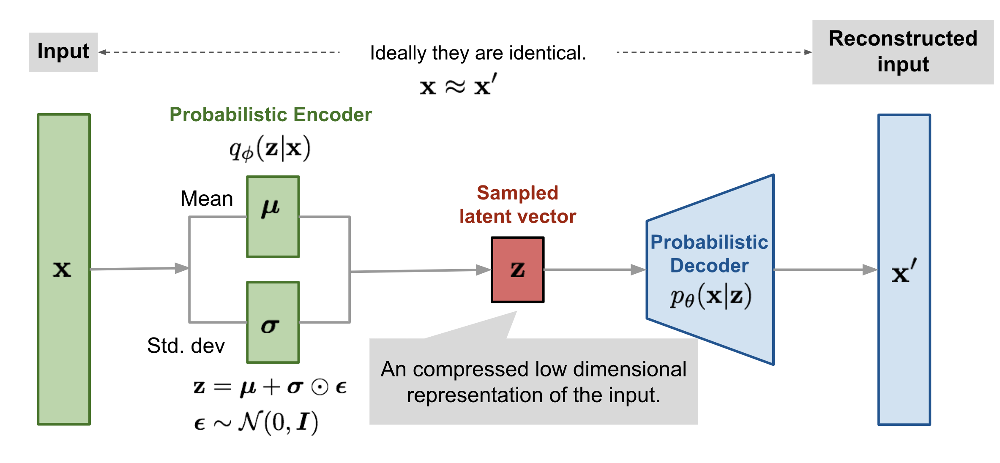
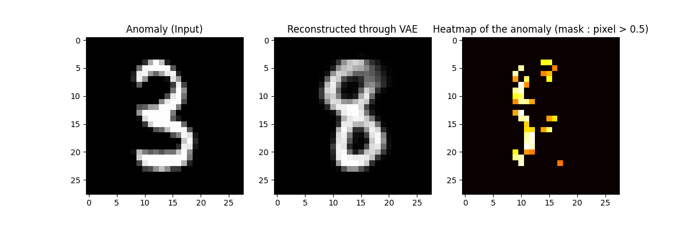
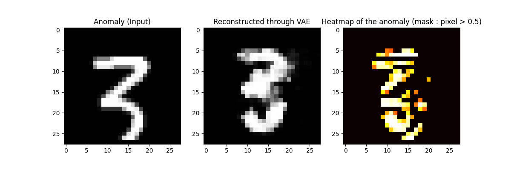
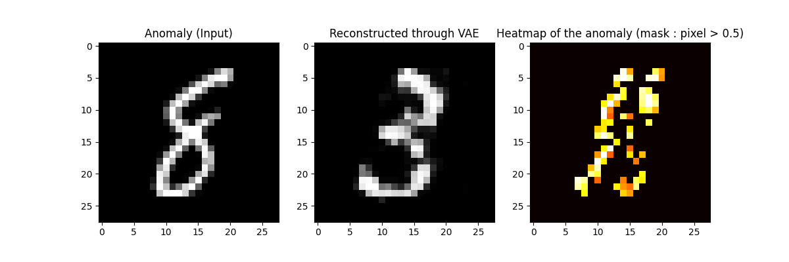

# Generating synthethic defaults from a low-shot dataset

We aim to evaluate the quality of a sample and the diversity of the defaults. We start with a simplified model using **VAE**. The second state-of-the-art model is Denoising Diffusion. Then we update the model through **LoRA** and **posterior sampling**.

## I. Variational Auto-Encoder

References :

- https://arxiv.org/pdf/1312.6114
- https://maitbayev.github.io/posts/auto-encoding-variational-bayes/
- https://www.youtube.com/watch?v=qJeaCHQ1k2w

Here is a sum up about how this model works (the code is pretty clear) :

### 1. Default projection in the healthy latent space

With MNIST dataset, we use the 6000 digits "$8$" as healthy material (symetric) to train our model. Then, with an input "$3$" representing the default (it lacks the left part of the $8$), the model projects it in the "$8$" latent space and reconstruct it. Here is the result :

### 2. The problem of low-shot default samples

After trying to train the model over a small dataset (10) of digits "$3$", we face an issue : the reconstruction doesn't work with anomalies either with normal samples.

It motives the use of the diffusion model and overall LoRA adaptation.

## II. Diffusion Models