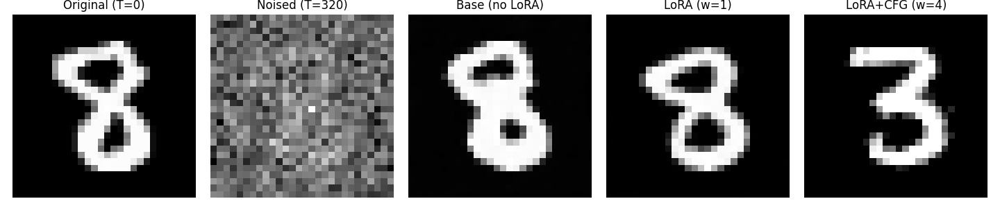

# Synthetic Defect Generation using Diffusion Models

## 1. Project Overview

* We want to **generate defects on image of materials**. The dataset we're using contains **few positive** samples (the anomalies) and many negative samples (the 'normal' material) because of the scarcity of defects in material inspection.

* The goal is to balance datasets to improve **defect detection networks** (?).

* The current proof-of-concept is validated on a **toy dataset** MNIST (e.g., converting a standard "8" into an anomalous "3").

## 2. Methodology

* **Generation model (DDPM):** U-Net architecture (`model.py`) with : ResBlocks (w. residual connections), Adaptive Layer Normalization for time embedding projection, and Self-Attention bottleneck.

* **Inference (Image-to-Image):** We inject noise into a normal image up to a specific timestep ($t < \text{time\_step}$), then denoise it by guiding it towards the anomaly distribution.

* **Fine-Tuning (LoRA):** To avoid overfitting on the small anomaly dataset, Low-Rank matrices are injected into the U-Net's `resblock2` and `decoder` modules.

## 3. Repository Structure

```text
├── data/
│   ├── train/ (normal / anomaly)
│   └── test/  (normal / anomaly)
├── parameters/
│   ├── ddpm_weights_lora.pth       # Trained weights with LoRA for CLG
│   └── ddpm_weights_normal.pth     # Trained weights from the DDPM only
├── dataloader.py    # DataLoader implementation
├── finetuning.py    # LoRA layer for convolutions and injection logic
├── inference.py     # Inference with CFG and visualization
├── model.py         # U-Net architecture (with AdaLN and Self-Attention)
├── parameters.py    # Global hyperparameters (device, time steps, LoRA rank, etc.)
└── training.py      # Base DDPM training loop with cosine noise schedule

```

## 4. Usage Pipeline

* **Step 1: Base Model Pre-training**
* Command: `python training.py`
* Description: Trains the base U-Net on the large dataset of "normal" images. Outputs `ddpm_weights_normal.pth`.


* **Step 2: LoRA Fine-Tuning**
* Command: `python finetuning.py`
* Description: Freezes base weights, injects rank-4 LoRA matrices, and trains exclusively on the limited "anomaly" dataset. Outputs `ddpm_weights_lora.pth`.


* **Step 3: Inference and Comparison**
* Command: `python inference.py`
* Description: Takes a test image, applies partial forward diffusion, and compares three reverse generation methods: Base Model, LoRA without guidance ($w=1$), and LoRA with CFG ($w=4$).


## 5. Preliminary Results (Toy Dataset)


*Original (T=0) -> Noised (T=320) -> Base (no LoRA) -> LoRA (w=1) -> LoRA+CFG (w=4)*

The LoRA model without guidance almost perfectly resamples the normal material $8$ while the use of guidance apparently works very well in eliminating the left part of the $8$ to build a $3$.

## 6. Future Work